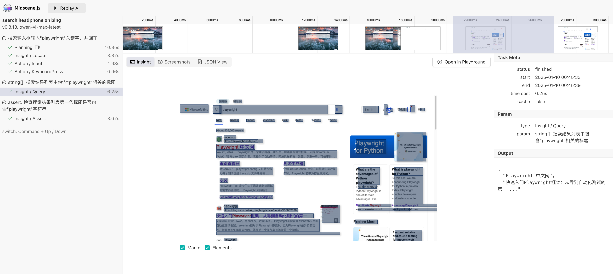

# playwright-mind

> 基于`playwright`和`midscene.js`自动化测试项目，给`Playwright`插上AI的翅膀，目前可以落地的AI自动化测试项目。

__技术栈：__

* [plywright](https://github.com/microsoft/playwright) Web UI自动化测试工具。

* [midscene.js](https://github.com/web-infra-dev/midscene) 提供AI定位断言能力。


## 安装与配置

1. 克隆项目到本地：

```shell
git clone https://github.com/autotestclass/playwright-mind
```

2. 安装依赖

```shell
cd playwright-mind
npm install
```

3. 安装运行浏览器

```shell
npx playwright install
```

4. 配置大模型

> 本项目默认使用 `qwen-vl-max-latest` 模型, 经过验证可用，关键是免费。如果想其他模型请参考midscenejs官方配置。

阿里云百练：https://bailian.console.aliyun.com/

使用其他模型：https://midscenejs.com/zh/model-provider.html

在 `.env` 文件中配置环境变量：

```ts
export OPENAI_API_KEY="sk-your-key"
export OPENAI_BASE_URL="https://dashscope.aliyuncs.com/compatible-mode/v1"
export MIDSCENE_MODEL_NAME="qwen-vl-max-latest"
```

## 使用示例

在项目的`test`目录，附带了`bing-search-ai-example.spec.ts`例子。

__示例代码__

```ts
import { expect } from "@playwright/test";
import { test } from "./fixture/fixture";

test.beforeEach(async ({ page }) => {
  await page.goto("https://cn.bing.com");
});

test('search keyword on bing', async ({ page, ai, aiQuery, aiAssert }) => {
  // 👀 输入关键字，执行搜索
  await ai('搜索输入框输入"playwright"关键字，并回车');
  await page.waitForTimeout(3000);

  // 👀 找到列表里耳机相关的信息
  const items = await aiQuery(
    'string[], 搜索结果列表中包含"playwright"相关的标题'
  );

  console.log("search result", items);
  console.log("search result number", items?.length);
  // 断言大于 1 条搜索结果
  expect(items?.length).toBeGreaterThan(1);

  // 👀 用 AI 断言
  await aiAssert('检查搜索结果列表第一条标题是否包含"playwright"字符串');
});
```

三种关键方法：交互（.ai, .aiAction）, 提取 (.aiQuery), 断言 (.aiAssert)。

* `.ai`方法描述步骤并执行交互
* `.aiQuery` 从 UI 中“理解”并提取数据，返回值是 JSON 格式，你可以尽情描述想要的数据结构
* `.aiAssert` 来执行断言

__运行测试__

```shell
npx playwright test --headed tests/bing-search-ai-example.spec.ts

Running 1 test using 1 worker

  ✓  1 [chromium] › baidu-search-ai-example.spec.ts:9:5 › search headphone on bing (52.1s)
search result [ 'Playwright 中文网', '快速入门Playwright框架：从零到自动化测试的第一 ...' ]
search result number 2
Midscene - report file updated: /Users/fnngj/zhpro/github/playwright-mind/midscene_run/report/playwright-merged-2025-01-10_00-44-50-464.html

  Slow test file: [chromium] › baidu-search-ai-example.spec.ts (52.1s)
  Consider splitting slow test files to speed up parallel execution
  1 passed (55.3s)
Midscene - report file updated: /Users/fnngj/zhpro/github/playwright-mind/midscene_run/report/playwright-merged-2025-01-10_00-44-50-464.html
```

__测试报告__


